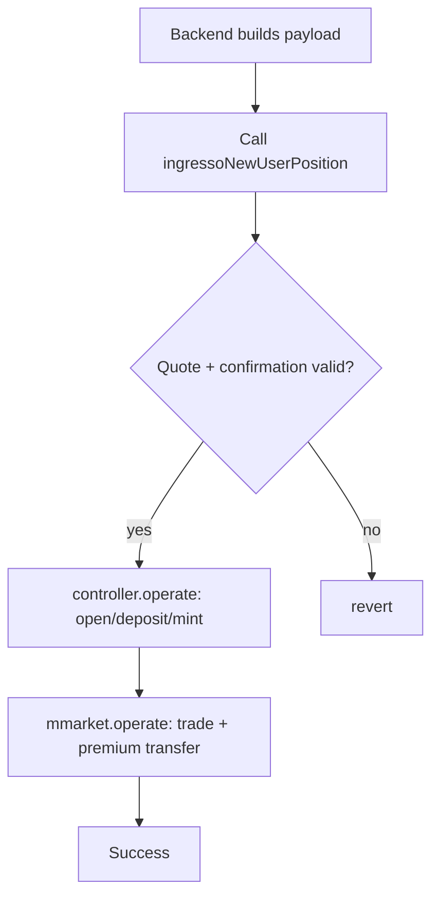
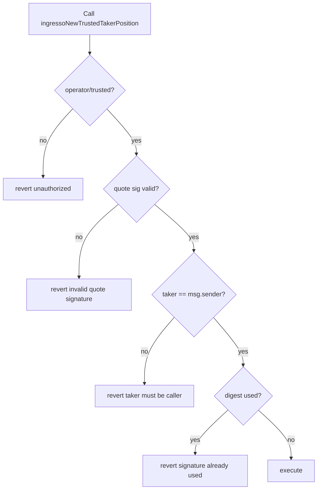

# Options Documentation (EN)

Language: **EN**

## Contents

1. [Glossary & Conventions](#1-glossary--conventions)
2. [Requirements](#2-requirements)
3. [Operation Flow](#3-operation-flow)
4. [Permission Model](#4-permission-model)
5. [User Journey & Algorithms](#5-user-journey--algorithms)
6. [Frontend/Backend Integration](#6-frontendbackend-integration)
7. [API Reference](#7-api-reference)
8. [Error Reference](#8-error-reference)

## 1. Glossary & Conventions

## Core terms

- `Operator`: backend signer for operational calls.
- `Trusted Taker`: whitelisted caller on trusted-taker entrypoints.
- `Trusted Maker`: whitelisted maker address accepted by trusted-maker entrypoints.
- `Taker`: vault owner in order confirmation payload.
- `Maker`: quote signer.
- `Vault`: margin account used by controller.
- `Cycle`: one strategy round.

## Numeric conventions

- Price uses either `1e8` or `1e18` depending on field.
- Otoken mint amount often maps `quantity(e18) / 1e10 -> e8`.
- Strategy precision constant is `1e18`.

## Time conventions

- Unix seconds everywhere.
- Strategy cycle boundaries align to `startTime + n * cycleDuration`.

## Current limitations

- `ingressoOTCTrade` disabled.
- `flashLoanRedeem` / `executeOperation` disabled.

## 2. Requirements

## Goal

Provide a backend-driven options execution layer that standardizes:
- signature checks,
- open/settle/redeem lifecycle,
- integration with Controller/MMarket/MarginPool/OtokenFactory.

## Roles

- `owner`: config and permission admin for operator, trusted taker/maker lists, and makerWhitelist.
- `operator`: routine execution calls.
- `trustedTakers`: trusted route callers with tighter taker binding.
- `trustedMakers`: maker allowlist for trusted-maker route.
- `makerWhitelist`: maker => receiver mapping; when set, `ingressoRedeem` uses the registered receiver as redemption payee instead of maker itself.

## Functional requirements

1. `ingressoNewUserPosition`
- verify quote + confirmation signatures,
- open vault, deposit collateral, mint short,
- execute market leg and premium transfer.

2. `ingressoNewTrustedTakerPosition`
- verify maker quote signature,
- enforce `sellerConfirmation.taker == msg.sender`.

3. `ingressoNewTrustedMakerPosition`
- verify taker confirmation signature,
- enforce maker allowlist check (`trustedMakers[maker] == true`).

3. Settlement/redeem
- batch settle via `ingressoSettle`,
- redeem path via `ingressoRedeem`; if maker has an entry in `makerWhitelist`, that receiver is used as `secondAddress` instead of maker.

4. Asset transfer
- signed transfer via `ingressoTransferAsset` (user signs, user2 = user),
- `ingressoMMarketDeposit`: deposit into mmarket (isDeposit=true only); supports optional `payer` — a third party who funds the deposit on behalf of `user` (150-byte payload); without payer, user funds themselves (130-byte payload),
- reserve donation via `donate`.

5. Maker receiver whitelist
- `setMakerWhitelist(maker, receiver)`: assign a dedicated redemption receiver per maker; pass `address(0)` to remove.

6. Composite operations (atomic)
- `ingressoDepositAndOpen`: atomically executes `ingressoTransferAsset` + `ingressoNewUserPosition` in one transaction.
- `ingressoDepositAndRedeem`: atomically executes `ingressoTransferAsset` + `ingressoRedeem` in one transaction.

## Out of scope in current release

- OTC trading flow.
- Flash-loan physical redeem flow.

## 3. Operation Flow

## Standard open-position flow



## Trusted open-position flow

1. Call `ingressoNewTrustedTakerPosition(payload)`.
2. Verify quote signature.
3. Verify `taker == msg.sender`.
4. Execute the same open-position actions.

## Settlement flow

1. Build `SettleVault` actions.
2. Call `ingressoSettle(actions)`.
3. Validate action shape.
4. Forward to `controller.operate`.

## Redeem flow

1. mmarket withdraw returns the otoken (`operations[0].user1` = maker).
2. Contract resolves receiver: `makerWhitelist[maker]` if non-zero, else maker itself.
3. Execute gamma redeem; proceeds go to resolved receiver.

## Composite operation flows

### ingressoDepositAndOpen

1. Backend builds `transferPayload` (signed Transfer, isDeposit=true) and `orderPayload` (signed Quote+Confirmation).
2. Call `ingressoDepositAndOpen(transferPayload, orderPayload)`.
3. Contract executes `_doTransferAsset` → verifies transfer sig, deposits into mmarket.
4. Contract executes `_doNewUserPosition` → verifies quote+conf sigs, opens vault position.
5. Both steps succeed or the whole tx reverts.

### ingressoDepositAndRedeem

1. Backend builds `transferPayload`, `operations` (mmarket withdraw), and `actions` (redeem).
2. Call `ingressoDepositAndRedeem(transferPayload, operations, actions)`.
3. Contract executes `_doTransferAsset` → verifies transfer sig, deposits into mmarket.
4. Contract executes `_doRedeem` → validates receiver (makerWhitelist), withdraw + redeem.

## MMarket deposit flow (ingressoMMarketDeposit)

Supports an optional `payer` — a third party who provides the funds on behalf of `user`.

**Without payer (130-byte payload, `payer = address(0)`):**
1. Backend builds a 130-byte `Transfer` payload with `isDeposit = true`.
2. `user` signs the Transfer digest.
3. Call `ingressoMMarketDeposit(payload)`.
4. Contract verifies signer == `user` and `isDeposit == true`.
5. Execute mmarket Deposit: `user1 = user`, `user2 = user` (user funds themselves).

**With payer (150-byte payload, `payer` appended as last 20 bytes):**
1. Backend builds a 150-byte `Transfer` payload (`payer` appended after `user`).
2. `payer` signs the Transfer digest (same EIP-712 type — `payer` is not in the signed fields).
3. Call `ingressoMMarketDeposit(payload)`.
4. Contract verifies signer == `payer` and `isDeposit == true`.
5. Execute mmarket Deposit: `user1 = user`, `user2 = payer` (payer funds the deposit).

## Failure branch



## 4. Permission Model

## Roles

- `owner`: configuration authority.
- `operator`: operational executor.
- `trustedTaker`: trusted-taker path executor.
- `trustedMaker`: trusted-maker allowlisted maker.

## Permission matrix

| Capability | owner | operator | trustedTaker |
|---|---:|---:|---:|
| config setters | ✅ | ❌ | ❌ |
| setMakerWhitelist | ✅ | ❌ | ❌ |
| ingressoNewUserPosition | ❌ | ✅ | ❌ |
| ingressoNewTrustedTakerPosition | ❌ | ✅ | ✅ |
| ingressoSettle | ❌ | ✅ | ✅ |
| ingressoRedeem / ingressoTransferAsset / ingressoMMarketDeposit / donate | ❌ | ✅ | ❌ |
| ingressoDepositAndOpen / ingressoDepositAndRedeem | ❌ | ✅ | ❌ |

## Security constraints

1. trusted path enforces `taker == msg.sender`.
2. digest replay protection via `isDigestUsed`.
3. critical address setters reject zero address.
4. `ingressoRedeem` receiver check: `makerWhitelist[user1]` takes precedence; falls back to `user1` when not set.
5. `ingressoMMarketDeposit` enforces `isDeposit == true`; signature is validated against `effectivePayer` (falls back to `user` when `payer == address(0)`).

## 5. User Journey & Algorithms

## User journey

1. maker signs quote.
2. taker confirms order payload.
3. backend submits transaction.
4. protocol opens, trades, settles, redeems.

## Option type and settlement analysis

- Call: upside underlying exposure.
- Put: downside underlying exposure.
- Cash-settled: payout in settlement currency.
- Physically-settled: requires asset exchange at exercise.

Current code note:
- trading payload can encode settlement type,
- flash-loan physical redeem helper is currently disabled.

## Core formulas

```text
totalPremium = quantity * price * 10^usdDecimals / 1e36
mintAmount(e8) = quantity(e18) / 1e10
```

## Signature model

- quote digest,
- confirmation digest,
- transfer digest,
- digest replay guard in storage.

## Trusted route constraint

- no confirmation signature check,
- but strict `sellerConfirmation.taker == msg.sender`.

## 6. Frontend/Backend Integration

## Contract entrypoints

| Function | Caller | Description |
|---|---|---|
| `ingressoNewUserPosition(bytes)` | operator | dual-signature open position |
| `ingressoNewTrustedTakerPosition(bytes)` | operator/trusted | trusted open (quote sig only, taker == msg.sender) |
| `ingressoNewTrustedMakerPosition(bytes)` | operator | trusted open (conf sig only, maker in trustedMakers) |
| `ingressoSettle(ActionArgs[])` | operator/trusted | batch settle |
| `ingressoRedeem(Operation[], ActionArgs[])` | operator | redeem path; receiver resolved via makerWhitelist |
| `ingressoTransferAsset(bytes)` | operator | signed deposit/withdraw from mmarket |
| `ingressoMMarketDeposit(bytes)` | operator | mmarket deposit (isDeposit=true only); optional payer funds deposit on behalf of user |
| `ingressoDepositAndOpen(bytes, bytes)` | operator | atomic: transfer asset + dual-sig open position |
| `ingressoDepositAndRedeem(bytes, Operation[], ActionArgs[])` | operator | atomic: transfer asset + redeem |
| `donate(address,uint256)` | operator | donate to margin pool |

## Admin entrypoints

| Function | Caller | Description |
|---|---|---|
| `setMakerWhitelist(address maker, address receiver)` | owner | set dedicated redemption receiver per maker; receiver=0 removes entry |

## Payload constraints

- Quote+Confirmation payload length: `345`
- Transfer payload length: `130` (no payer) or `150` (with payer appended as last 20 bytes)
- OTC payload length: `185` (feature disabled)

## Error mapping (suggested)

- `bad operator` -> 403
- `unauthorized` -> 403
- `invalid quote signature` -> 400
- `invalid confirmation signature` -> 400
- `taker must be caller` -> 400
- `signature already used` -> 409
- `redeem receiver must be otoken owner or whitelisted receiver` -> 400
- `invalid transfer isDeposit` -> 400
- `zero maker` -> 400
- `not support` -> 410/501

## Example code

- React+TS: `docs/en/examples/react-ts/options.ts`
- Go + go-zero: `docs/en/examples/go-zero/options_logic.go`

## 7. API Reference

## Structs

### Actions.ActionArgs

```solidity
(ActionType actionType, address owner, address secondAddress, address asset, uint256 vaultId, uint256 amount, uint256 index, bytes data)
```

### MMarketOperations.Operation

```solidity
(OperationType operationType, address user1, address user2, address asset1, address asset2, uint256 amount1, uint256 amount2, bytes data)
```

## Suggested go-zero endpoints

- `POST /options/trusted-position`
- `POST /options/settle`
- `POST /options/redeem`
- `POST /options/transfer-asset`
- `POST /options/mmarket-deposit`
- `POST /options/deposit-and-open`
- `POST /options/deposit-and-redeem`
- `POST /admin/options/maker-whitelist`

## Sample request

```json
{
  "payload": "0x..."
}
```

## 8. Error Reference
## Options revert strings

| Error | Scenario |
|---|---|
| `bad operator` | non-operator calls operator-only function |
| `unauthorized` | non-operator and non-trusted caller |
| `invalid quote signature` | quote sig verification failed |
| `invalid confirmation signature` | confirmation sig verification failed |
| `taker must be caller` | trusted path taker mismatch |
| `signature already used` | digest replay attempt |
| `redeem receiver must be otoken owner or whitelisted receiver` | `ingressoRedeem` secondAddress is neither maker nor whitelisted receiver |
| `invalid transfer isDeposit` | `ingressoMMarketDeposit` received isDeposit=false payload |
| `zero maker` | `setMakerWhitelist` called with maker=0 |
| `not support` | OTC/flash-loan entrypoints disabled |
