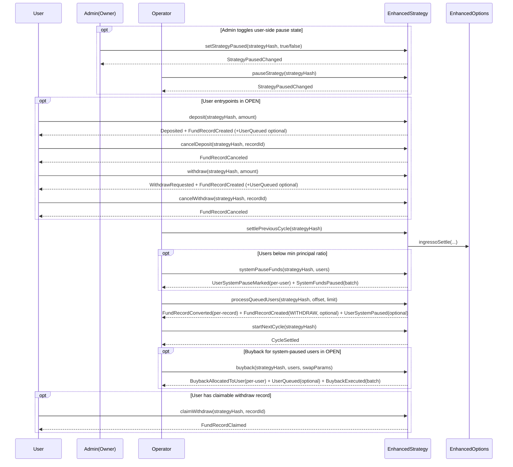

# Strategy Documentation (EN)

Language: **English**

## strategyHash Calculation (Read First)

`strategyHash` is computed from the full `StrategyParams` struct:

```solidity
strategyHash = keccak256(abi.encode(params));
```

The field order in `params` must exactly match the on-chain struct:

1. `cycleDuration`
2. `underlyingAsset`
3. `collateralAsset`
4. `strikeAsset`
5. `isPut`
6. `capacity`
7. `minInvestmentAmount`
8. `startTime`
9. `strikePriceBps`
10. `minPrincipalRatio`
11. `buybackPriceRatio`

Integration notes:

- Any field difference leads to a different `strategyHash`.
- Use `abi.encode`, not `abi.encodePacked`.
- Backend and frontend should reuse the same encoding logic to avoid hash mismatches.

## Core Call Sequence



## Contents

1. [strategyHash Calculation (Read First)](#strategyhash-calculation-read-first)
2. [Scope](#1-scope)
3. [Roles and Permissions](#2-roles-and-permissions)
4. [Cycle Advancement Overview](#3-cycle-advancement-overview)
5. [Owner Interfaces](#4-owner-interfaces)
6. [Operator Interfaces](#5-operator-interfaces)
7. [User Interfaces](#6-user-interfaces)
8. [Public View Interfaces](#7-public-view-interfaces)
9. [Key State Fields](#8-key-state-fields)
10. [Key Events](#9-key-events)

## 1. Scope

This document is for integrators, backend services, and frontend index/query layers. It describes the current behavior of `EnhancedStrategy`.

- Based on the current implementation of [`EnhancedStrategy.sol`](../../src/periphery/strategy/EnhancedStrategy.sol).
- Organized by caller role, not source-code order.
- "Pending record" means `FundRecord` with `id` as `recordId`.
- "Queue" means `_transitionQueues[strategyHash].users`.
- Covers write APIs, main read APIs, and inherited governance/upgrade interfaces.

## 2. Roles and Permissions

| Role | Typical caller | Responsibilities |
| -- | -- | -- |
| `Owner` | multisig / governance | create strategy, update dependencies, set operator, token approvals |
| `Operator` | ops backend | cycle progression, order creation, buyback, queue pagination |
| `User` | user wallet | deposit, cancel deposit, withdraw, cancel withdraw, claim withdraw |
| `Public View` | frontend / indexer / backend | read strategy state, user fund state, queue status, cycle records |

| Interface | Owner | Operator | User | Description |
| -- | -- | -- | -- | -- |
| `createStrategy` | ✅ | ❌ | ❌ | Create a strategy |
| `setStrategyActive` | ✅ | ❌ | ❌ | Toggle strategy active status |
| `setStrategyPaused` | ✅ | ❌ | ❌ | Set user-side paused status (pause/unpause) |
| `setStrategyEnd` | ✅ | ❌ | ❌ | Set strategy end/offline status |
| `pauseStrategy` | ❌ | ✅ | ❌ | Operator emergency pause for user actions (pause-only) |
| `setOperator` | ✅ | ❌ | ❌ | Set operator account |
| `setStrategySigner` | ✅ | ❌ | ❌ | Set order signer |
| `setMarginPool` | ✅ | ❌ | ❌ | Set margin pool |
| `setAssetApproval` | ✅ | ❌ | ❌ | Set `marginPool` token approval |
| `setAssetApprovalSwapRouter` | ✅ | ❌ | ❌ | Set `swapRouter` token approval |
| `setSwapRouter` | ✅ | ❌ | ❌ | Set buyback swap router |
| `setEnhancedOptions` | ✅ | ❌ | ❌ | Set `EnhancedOptions` address |
| `nextCycle` | ❌ | ✅ | ❌ | One-shot settle + process queue + start next cycle |
| `settlePreviousCycle` | ❌ | ✅ | ❌ | Settle only |
| `systemPauseFunds` | ❌ | ✅ | ❌ | Batch mark users for system pause (after settle, before queue processing) |
| `processQueuedUsers` | ❌ | ✅ | ❌ | Process queued users in pages |
| `startNextCycle` | ❌ | ✅ | ❌ | Start the next cycle after queue processing |
| `createOrder` | ❌ | ✅ | ❌ | Open an options position |
| `buyback` | ❌ | ✅ | ❌ | Swap premium into collateral and allocate to users |
| `deposit` | ❌ | ❌ | ✅ | Deposit collateral |
| `cancelDeposit` | ❌ | ❌ | ✅ | Cancel pending deposit |
| `withdraw` | ❌ | ❌ | ✅ | Request pause on active funds |
| `cancelWithdraw` | ❌ | ❌ | ✅ | Cancel withdraw request |
| `claimWithdraw` | ❌ | ❌ | ✅ | Claim withdrawable collateral |
| `get*` read APIs | ✅ | ✅ | ✅ | Public read access |

## 3. Cycle Advancement Overview

Current implementation supports two progression modes:

1. One-shot: `nextCycle(strategyHash)`
2. Three-step: `settlePreviousCycle(strategyHash)` -> `processQueuedUsers(strategyHash, offset, limit)` -> `startNextCycle(strategyHash)`

For system-pause flow, recommended sequence is:

`settlePreviousCycle` -> `systemPauseFunds` -> `processQueuedUsers` -> `startNextCycle`

Phase interpretation:

- `OPEN`
  - User writes: `deposit`, `cancelDeposit`, `withdraw`, `cancelWithdraw`
  - Operator writes: `createOrder`, `buyback`
- `SETTLED` / `PROCESSING_DONE`
  - `withdraw` / `cancelWithdraw` are also allowed when strategy is active and not paused (`isActive = true && isPaused = false`)
- `SETTLED`
  - Previous cycle is settled
  - `systemPauseFunds` can be called to mark users
  - then `processQueuedUsers` can be executed
- `PROCESSING_DONE`
  - Queue snapshot fully processed
  - only `startNextCycle` is allowed
- `OPEN`
  - New cycle starts
- `isEnd = true` (strategy offline)
  - Only user writes allowed: `withdraw`, `claimWithdraw`
  - Only operator settlement pipeline allowed: `nextCycle`, `settlePreviousCycle`, `processQueuedUsers`, `startNextCycle`
  - All other user/operator write actions are rejected

Responsibilities in the three-step pipeline:

- `settlePreviousCycle`
  - check cycle end time
  - settle vaults in previous cycle
  - update `cycleRecords`, `cumCollateral`, `cumPremium`
  - freeze queue snapshot length
- `processQueuedUsers`
  - process users in snapshot exactly once
  - convert pending deposits into active
  - convert pending withdraw requests into pending withdraws
  - clear user pending state for this cycle
- `startNextCycle`
  - apply capacity reduction
  - increment `currentCycleId`
  - align and set `currentCycleStart`
  - clear queue snapshot and return to `OPEN`

## 4. Owner Interfaces

### createStrategy

Description: create a new strategy. The strategy ID is `keccak256(abi.encode(StrategyParams))`.

Signature: `function createStrategy(StrategyParams calldata _params) external returns (bytes32 strategyHash)`

Caller role: `Owner`

Parameters:

| Field | Type | Description |
| -- | -- | -- |
| `_params.cycleDuration` | `uint256` | Cycle duration |
| `_params.underlyingAsset` | `address` | Underlying asset |
| `_params.collateralAsset` | `address` | Collateral asset |
| `_params.strikeAsset` | `address` | Strike asset |
| `_params.isPut` | `bool` | Put strategy flag |
| `_params.capacity` | `uint256` | Capacity limit |
| `_params.minInvestmentAmount` | `uint256` | Min deposit amount |
| `_params.startTime` | `uint256` | Start timestamp |
| `_params.strikePriceBps` | `int256` | Signed strike-price metadata ratio (`10000` precision, `-10000` to `10000`) |
| `_params.minPrincipalRatio` | `uint256` | Minimum principal ratio threshold (`10000` precision) |
| `_params.buybackPriceRatio` | `int256` | Buyback price adjustment ratio (`10000` precision, `-10000` to `10000`) |

Returns:

| Field | Type | Description |
| -- | -- | -- |
| `strategyHash` | `bytes32` | Unique strategy identifier |

Preconditions:

- `cycleDuration != 0`
- `startTime != 0`
- `collateralAsset / underlyingAsset / strikeAsset` are non-zero addresses
- `strikePriceBps` must be within `[-10000, 10000]`
- `buybackPriceRatio` must be within `[-10000, 10000]`
- strategy with same params does not exist

State changes:

- initialize `strategies[strategyHash]`
- `isActive = true`
- `isPaused = false`
- `isEnd = false`
- `currentCycleId = 1`
- `currentCycleStart = startTime`
- `totalDeposited = 0`
- `cycleRecords[strategyHash][1].remainingActiveCollateral = 0`
- `cumCollateral[strategyHash][0] = 1e18`
- `cumPremium[strategyHash][0] = 0`
- `strategyPhases[strategyHash] = OPEN`
- `_transitionQueues[strategyHash].queueCycleId = 1`

Events:

- `StrategyCreated(strategyHash, cycleDuration, underlyingAsset, collateralAsset, strikeAsset, isPut, capacity, minInvestmentAmount, startTime, strikePriceBps, minPrincipalRatio, buybackPriceRatio)` (granularity: single call, global)

### setStrategyActive

Description: toggle strategy active status.

Signature: `function setStrategyActive(bytes32 strategyHash, bool _active) external`

Caller role: `Owner`

Parameters:

| Field | Type | Description |
| -- | -- | -- |
| `strategyHash` | `bytes32` | Strategy id |
| `_active` | `bool` | Active flag |

Returns: none

State changes:

- `strategies[strategyHash].isActive = _active`

Events:

- `StrategyActiveChanged(strategyHash, _active)` (granularity: single call, global)

### setStrategyPaused

Description: set strategy user-side paused status. This pause only affects user write operations, not operator operations.

Signature: `function setStrategyPaused(bytes32 strategyHash, bool _paused) external`

Caller role: `Owner`

Parameters:

| Field | Type | Description |
| -- | -- | -- |
| `strategyHash` | `bytes32` | Strategy id |
| `_paused` | `bool` | User-side paused flag |

Returns: none

State changes:

- `strategies[strategyHash].isPaused = _paused`

Events:

- `StrategyPausedChanged(strategyHash, _paused)` (granularity: single call, global)

### setStrategyEnd

Description: set strategy end/offline status. When `isEnd = true`, user/operator write permissions are reduced to withdraw/claim/settlement pipeline only.

Signature: `function setStrategyEnd(bytes32 strategyHash, bool _end) external`

Caller role: `Owner`

Parameters:

| Field | Type | Description |
| -- | -- | -- |
| `strategyHash` | `bytes32` | Strategy id |
| `_end` | `bool` | End/offline flag |

Returns: none

State changes:

- `strategies[strategyHash].isEnd = _end`

Events:

- `StrategyEndChanged(strategyHash, _end)` (granularity: single call, global)

### setOperator

Description: set operator account.

Signature: `function setOperator(address _operator) external`

Caller role: `Owner`

Parameters:

| Field | Type | Description |
| -- | -- | -- |
| `_operator` | `address` | New operator |

Returns: none

Preconditions:

- `_operator != address(0)`

State changes:

- `operator = _operator`

Events:

- `OperatorChanged(_operator, oldOperator)` (granularity: single call, global)

### setStrategySigner

Description: set signer used by `createOrder`.

Signature: `function setStrategySigner(address _signer) external`

Caller role: `Owner`

Parameters:

| Field | Type | Description |
| -- | -- | -- |
| `_signer` | `address` | New signer |

Returns: none

Preconditions:

- `_signer != address(0)`

State changes:

- `strategySigner = _signer`

Events:

- none (granularity: none)

### setMarginPool

Description: set margin pool address for approvals.

Signature: `function setMarginPool(address _marginPool) external`

Caller role: `Owner`

Parameters:

| Field | Type | Description |
| -- | -- | -- |
| `_marginPool` | `address` | Margin pool |

Returns: none

Preconditions:

- `_marginPool != address(0)`

State changes:

- `marginPool = _marginPool`

Events:

- none (granularity: none)

### setAssetApproval

Description: set ERC20 approval for `marginPool`.

Signature: `function setAssetApproval(address _asset, bool _approval) external`

Caller role: `Owner`

Parameters:

| Field | Type | Description |
| -- | -- | -- |
| `_asset` | `address` | Token to approve |
| `_approval` | `bool` | `true`: max approval, `false`: set to zero |

Returns: none

Preconditions:

- `marginPool != address(0)`

State changes:

- if `_approval == true`, approve `type(uint256).max`
- if `_approval == false`, approve `0`

Events:

- none (granularity: none)

### setAssetApprovalSwapRouter

Description: set ERC20 approval for `swapRouter`.

Signature: `function setAssetApprovalSwapRouter(address _asset, bool _approval) external`

Caller role: `Owner`

Parameters:

| Field | Type | Description |
| -- | -- | -- |
| `_asset` | `address` | Token to approve |
| `_approval` | `bool` | `true`: max approval, `false`: set to zero |

Returns: none

Preconditions:

- `swapRouter != address(0)`

State changes:

- if `_approval == true`, approve `type(uint256).max`
- if `_approval == false`, approve `0`

Events:

- none (granularity: none)

### setSwapRouter

Description: set Uniswap V3 router for buyback.

Signature: `function setSwapRouter(address _router) external`

Caller role: `Owner`

Parameters:

| Field | Type | Description |
| -- | -- | -- |
| `_router` | `address` | Router address |

Returns: none

State changes:

- `swapRouter = _router`

Events:

- none (granularity: none)

### setEnhancedOptions

Description: set `EnhancedOptions` contract address.

Signature: `function setEnhancedOptions(address _enhancedOptions) external`

Caller role: `Owner`

Parameters:

| Field | Type | Description |
| -- | -- | -- |
| `_enhancedOptions` | `address` | New `EnhancedOptions` address |

Returns: none

Preconditions:

- `_enhancedOptions != address(0)`

State changes:

- `enhancedOptions = IEnhancedOptions(_enhancedOptions)`

Events:

- none (granularity: none)

### Standard Governance and Upgrade Interfaces

Inherited from `OwnableUpgradeable`, `UUPSUpgradeable`, and `EIP712Upgradeable`:

| Signature | Caller | Description |
| -- | -- | -- |
| `function owner() external view returns (address)` | `Public View` | Current owner |
| `function transferOwnership(address newOwner) external` | `Owner` | Transfer ownership |
| `function renounceOwnership() external` | `Owner` | Renounce ownership |
| `function upgradeToAndCall(address newImplementation, bytes memory data) external payable` | `Owner` | UUPS upgrade entry |
| `function proxiableUUID() external view returns (bytes32)` | `Public View` | UUPS slot id |
| `function UPGRADE_INTERFACE_VERSION() external view returns (string memory)` | `Public View` | Upgrade interface version |
| `function eip712Domain() external view returns (...)` | `Public View` | EIP-712 domain info |
| `function initialize(address _enhancedOptions, address _operator, address _strategySigner) external` | `Deployment` | Proxy initializer (once) |

Events:

- `transferOwnership` / `renounceOwnership`: `OwnershipTransferred(previousOwner, newOwner)` (granularity: single call, global)
- `upgradeToAndCall`: `Upgraded(newImplementation)` (granularity: single call, global)
- `owner` / `proxiableUUID` / `UPGRADE_INTERFACE_VERSION` / `eip712Domain` / `initialize`: none (granularity: none)

## 5. Operator Interfaces

### pauseStrategy

Description: operator emergency pause for user operations. This function can only set pause to `true` (no unpause path).

Signature: `function pauseStrategy(bytes32 strategyHash) external`

Caller role: `Operator`

Parameters:

| Field | Type | Description |
| -- | -- | -- |
| `strategyHash` | `bytes32` | Strategy id |

Returns: none

Preconditions:

- strategy is active (`isActive = true`)
- strategy is not ended (`isEnd = false`)

State changes:

- `strategies[strategyHash].isPaused = true`

Events:

- `StrategyPausedChanged(strategyHash, true)` (granularity: single call, global)

### nextCycle

Description: one-shot settlement, queue processing, and next cycle start.

Signature: `function nextCycle(bytes32 strategyHash) external`

Caller role: `Operator`

Parameters:

| Field | Type | Description |
| -- | -- | -- |
| `strategyHash` | `bytes32` | Strategy id |

Returns: none

Execution flow:

1. call `_settlePreviousCycle`
2. read queue snapshot length
3. process queue in `MAX_BATCH_SIZE` pages
4. call `_startNextCycle`

Typical usage:

- small/medium queue size where one transaction can finish the full pipeline

Events:

- `FundRecordCreated(strategyHash, user, recordId, WITHDRAW, amount)` (granularity: per-user, per-record; only when converted withdraw amount `> 0`)
- `FundRecordConverted(...)` (granularity: per-user, per-record)
- `UserSystemPaused(...)` (granularity: per-user; only if user was system-pause marked)
- `CycleSettled(...)` (granularity: single call, global)

### settlePreviousCycle

Description: settle previous cycle only, then move phase to `SETTLED` or `PROCESSING_DONE`.

Signature: `function settlePreviousCycle(bytes32 strategyHash) external`

Caller role: `Operator`

Parameters:

| Field | Type | Description |
| -- | -- | -- |
| `strategyHash` | `bytes32` | Strategy id |

Returns: none

Preconditions:

- strategy is active or ended (`isActive = true || isEnd = true`)
- `strategyPhases[strategyHash] == OPEN`
- `block.timestamp >= currentCycleStart + cycleDuration`

State changes:

- settle all vaults in current cycle
- update `cycleRecords[cycleId]`
- update `cumCollateral[cycleId]` and `cumPremium[cycleId]`
- write `_cycleAdvanceStates[strategyHash]`
- snapshot queue length to `queueLenSnapshot`
- set `queueCycleId = settledCycleId`
- if snapshot length is `0`, phase -> `PROCESSING_DONE`
- otherwise phase -> `SETTLED`

Events:

- none (granularity: none)

### processQueuedUsers

Description: process users in the current queue snapshot by pages.

Signature: `function processQueuedUsers(bytes32 strategyHash, uint256 offset, uint256 limit) external`

Caller role: `Operator`

Parameters:

| Field | Type | Description |
| -- | -- | -- |
| `strategyHash` | `bytes32` | Strategy id |
| `offset` | `uint256` | Start index |
| `limit` | `uint256` | Page size (`> 0` and `<= MAX_BATCH_SIZE`) |

Returns: none

Preconditions:

- strategy is active or ended (`isActive = true || isEnd = true`)
- `strategyPhases[strategyHash] == SETTLED`
- `limit != 0`
- `limit <= MAX_BATCH_SIZE`

State changes:

- each user in snapshot is processed at most once
- settle user `activePrincipal` to settled-cycle projection
- convert pending deposits into active
- convert pending withdraw requests into pending withdraws
- update `stoppedPrincipal`
- clear user `pendingActivePrincipal` and `pendingWithdrawAmount`
- update `entryCumCollateral` and `entryCumPremium`
- if user is marked by `systemPauseFunds`:
  - move user into system-paused state in this processing round
  - `systemPausedPrincipal += settledActive + pendingActivePrincipal`
  - user does not enter next-cycle active
- after each successful user process: `processedCount += 1`
- if `processedCount == queueLenSnapshot`, phase -> `PROCESSING_DONE`

Events:

- `FundRecordCreated(strategyHash, user, recordId, WITHDRAW, amount)` (granularity: per-user, per-record; only when converted withdraw amount `> 0`)
- `FundRecordConverted(...)` (granularity: per-user, per-record)
- `UserSystemPaused(strategyHash, user, amount)` (granularity: per-user; only if user was system-pause marked)

### systemPauseFunds

Description: in `SETTLED`, backend submits candidate users. Contract validates threshold on-chain. Qualified users are marked for system pause and will be migrated during `processQueuedUsers`.

Signature: `function systemPauseFunds(bytes32 strategyHash, address[] calldata users) external`

Caller role: `Operator`

Parameters:

| Field | Type | Description |
| -- | -- | -- |
| `strategyHash` | `bytes32` | Strategy id |
| `users` | `address[]` | Candidate users to validate and mark |

Returns: none

Preconditions:

- strategy is active (`isActive = true`)
- strategy is not ended (`isEnd = false`)
- `strategyPhases[strategyHash] == SETTLED`
- `users.length > 0`
- `users.length <= MAX_BATCH_SIZE`
- `_cycleAdvanceStates[strategyHash].initialized == true`
- each user must pass on-chain threshold check:
  - project `settledActive` under settled-cycle ratio
  - compute `principalRatio = settledActive * 10000 / initialAmountTotal`
  - check `principalRatio + buybackPriceRatio < minPrincipalRatio`

State changes:

- set system-pause mark for each validated user
- no direct fund movement in this function; real migration happens in `processQueuedUsers`

Events:

- `UserSystemPauseMarked(strategyHash, user)` (granularity: per-user)
- `SystemFundsPaused(strategyHash, settledCycleId, userCount)` (granularity: single call, batch-global)

### startNextCycle

Description: start next cycle after queue processing is complete.

Signature: `function startNextCycle(bytes32 strategyHash) external`

Caller role: `Operator`

Parameters:

| Field | Type | Description |
| -- | -- | -- |
| `strategyHash` | `bytes32` | Strategy id |

Returns: none

Preconditions:

- strategy is active or ended (`isActive = true || isEnd = true`)
- `strategyPhases[strategyHash] == PROCESSING_DONE`
- `processedCount == queueLenSnapshot`
- `_cycleAdvanceStates[strategyHash].initialized == true`

State changes:

- apply `capReduction` to `strategies[strategyHash].totalDeposited`
- `currentCycleId = nextCycleId`
- `currentCycleStart = _alignedCycleStart(startTime, cycleDuration)`
- clear `_cycleAdvanceStates[strategyHash]`
- clear `queue.users`
- reset `queueLenSnapshot` and `processedCount`
- `queue.queueCycleId = currentCycleId`
- phase -> `OPEN`

Events:

- `CycleSettled(strategyHash, settledCycleId, nextCycleId, totalReturned, totalPremium, currentCycleStart, currentCycleEnd)` (granularity: single call, global)

### createOrder

Description: open a position in `EnhancedOptions`. Includes operator auth, strategy-signature check, and payload-parameter matching.

Signature: `function createOrder(bytes32 strategyHash, bytes calldata payload, bytes calldata stratSig) external`

Caller role: `Operator`

Parameters:

| Field | Type | Description |
| -- | -- | -- |
| `strategyHash` | `bytes32` | Strategy id |
| `payload` | `bytes` | Raw order payload |
| `stratSig` | `bytes` | `strategySigner` signature over `(strategyHash, payloadHash)` |

Returns: none

Preconditions:

- caller is `operator`
- strategy exists
- strategy is active (`isActive = true`)
- strategy is not ended (`isEnd = false`)
- strategy signature is valid
- payload confirmation fields match strategy params
- `taker == address(this)`
- enough `remainingActiveCollateral` for this order

State changes:

- call `enhancedOptions.ingressoNewTrustedTakerPosition(payload)`
- receive `(vaultId, premium)`
- `cycleRecords[strategyHash][currentCycleId].remainingActiveCollateral -= orderCollateral`
- `_vaultIds[strategyHash][currentCycleId].push(vaultId)`
- `_cyclePremium[strategyHash] += premium`

Events:

- `OrderCreated(strategyHash, vaultId)` (granularity: single call, global)

### buyback

Description: spend user materialized premium to buy back collateral, then write buyback result into user `pendingActivePrincipal`.

Signature: `function buyback(bytes32 strategyHash, address[] calldata users, SwapParams calldata swapParams) external`

Caller role: `Operator`

Parameters:

| Field | Type | Description |
| -- | -- | -- |
| `strategyHash` | `bytes32` | Strategy id |
| `users` | `address[]` | Users in this buyback batch |
| `swapParams.amountIn` | `uint256` | Total premium spent |
| `swapParams.amountOutMinimum` | `uint256` | Min collateral output |
| `swapParams.deadline` | `uint256` | Swap deadline |
| `swapParams.fee` | `uint24` | Uniswap V3 fee tier |

Returns: none

Preconditions:

- strategy is active (`isActive = true`)
- strategy is not ended (`isEnd = false`)
- phase must be `OPEN`
- `block.timestamp <= deadline`
- `users.length > 0`
- `users.length <= MAX_BATCH_SIZE`
- `amountIn > 0`
- each user has non-zero `materializedPremium`
- `amountIn <= sum(materializedPremium)`

State changes:

- deduct `materializedPremium` proportionally by user contribution
- call `swapRouter.exactInputSingle(...)`
- distribute collateral output proportionally
- for each user:
  - `pendingActivePrincipal += allocatedCollateral`
  - if not already queued, enqueue user

Notes:

- system-paused users are allowed in `buyback`
- buyback output still goes to `pendingActivePrincipal`; queue processing decides when it becomes active

Events:

- `BuybackAllocatedToUser(strategyHash, user, collateralReceived)` (granularity: per-user)
- `UserQueued(strategyHash, user)` (granularity: per-user; only if user was not already queued)
- `BuybackExecuted(strategyHash, totalPremiumSpent, totalCollateralReceived)` (granularity: single call, batch-global)

### Legacy Disabled Interfaces

The following legacy interfaces are intentionally disabled:

- `function forcePauseFunds(bytes32[] calldata) external pure`
- `function clearForceExit(bytes32) external pure`

Current behavior:

- always `revert LegacyInvestmentIdPathDisabled()`

## 6. User Interfaces

State requirements summary:

| Method | Callable phase |
| -- | -- |
| `deposit` | `OPEN` and strategy not ended + active + not paused (`isEnd = false && isActive = true && isPaused = false`) |
| `cancelDeposit` | `OPEN` and strategy not ended + active + not paused (`isEnd = false && isActive = true && isPaused = false`), with record created in current cycle |
| `withdraw` | Any phase; if `isEnd = true` it's directly allowed, otherwise requires `isActive = true && isPaused = false` |
| `cancelWithdraw` | Any phase when strategy not ended + active + not paused (`isEnd = false && isActive = true && isPaused = false`) |
| `claimWithdraw` | Any phase (no phase restriction) |

### deposit

Description: user deposits collateral. Funds do not become active immediately; they first enter pending-active state and are later processed via queue.

Signature: `function deposit(bytes32 strategyHash, uint256 amount) external`

Caller role: `User`

Callable phase: `OPEN` and strategy not ended + active + not paused (`isEnd = false && isActive = true && isPaused = false`)

Parameters:

| Field | Type | Description |
| -- | -- | -- |
| `strategyHash` | `bytes32` | Strategy id |
| `amount` | `uint256` | Deposit amount |

Returns: none

Preconditions:

- strategy exists
- phase is `OPEN`
- strategy is not ended (`isEnd = false`)
- strategy is active
- strategy is not paused (`isPaused = false`)
- `amount >= minInvestmentAmount`
- `totalDeposited + amount <= capacity`
- user has approved collateral token

State changes:

- transfer `amount` collateral from user to contract
- on first user initialization, copy strategy params into user reserved fields:
  - `minPrincipalRatio`
  - `buybackPriceRatio`
- `pendingActivePrincipal += amount`
- `initialAmountTotal += amount`
- `strategies[strategyHash].totalDeposited += amount`
- create a pending `DEPOSIT` record:
  - `pendingDepositRecords[strategyHash][user][recordId]`
  - `pendingDepositIds[strategyHash][user]`
  - `pendingDepositIndex[strategyHash][user][recordId]`
- enqueue user if not already queued

Events:

- `FundRecordCreated(strategyHash, user, recordId, DEPOSIT, amount)` (granularity: single user, single record)
- `UserQueued(strategyHash, user)` (granularity: single user; only on first enqueue)
- `Deposited(strategyHash, user, recordId, amount)` (granularity: single user)

### cancelDeposit

Description: cancel pending deposit in current cycle and refund user.

Signature: `function cancelDeposit(bytes32 strategyHash, uint256 recordId) external`

Caller role: `User`

Callable phase: `OPEN` (and `record.createdCycleId == currentCycleId`)

Parameters:

| Field | Type | Description |
| -- | -- | -- |
| `strategyHash` | `bytes32` | Strategy id |
| `recordId` | `uint256` | Pending deposit record id |

Returns: none

Preconditions:

- record belongs to `msg.sender`
- record is still pending
- phase is `OPEN`
- strategy is not ended and active + not paused (`isEnd = false && isActive = true && isPaused = false`)
- `currentCycleId == record.createdCycleId`
- `pendingActivePrincipal` and `initialAmountTotal` can cover `rec.amount`

State changes:

- `pendingActivePrincipal -= rec.amount`
- `initialAmountTotal -= rec.amount`
- `strategies[strategyHash].totalDeposited -= rec.amount`
- transfer collateral back to user
- remove pending deposit record

Events:

- `FundRecordCanceled(strategyHash, user, recordId, DEPOSIT, amountCanceled)` (granularity: single user, single record)

### withdraw

Description: request to stop part of active principal on next queue processing.

Signature: `function withdraw(bytes32 strategyHash, uint256 amount) external`

Caller role: `User`

Callable phase: any phase; if `isEnd = true` it's directly allowed, otherwise requires `isActive = true && isPaused = false`

Parameters:

| Field | Type | Description |
| -- | -- | -- |
| `strategyHash` | `bytes32` | Strategy id |
| `amount` | `uint256` | Requested withdraw amount |

Returns: none

Preconditions:

- strategy exists
- when strategy is not ended (`isEnd = false`): strategy must be active and not paused (`isActive = true && isPaused = false`)
- `amount > 0`
- user `activePrincipal > 0`
- `pendingWithdrawRequestIds + pendingWithdrawIds < MAX_PENDING_EXIT_RECORDS_PER_USER`

State changes:

- `pendingWithdrawAmount += amount`
- create pending `WITHDRAW_REQUEST` record
- if phase is `OPEN`, enqueue user immediately if not already queued
- if phase is `SETTLED` and user is still in current queue snapshot, request may be processed in current cycle
- otherwise, user is deferred and auto-enqueued at `startNextCycle` for next-cycle processing

Events:

- `FundRecordCreated(strategyHash, user, recordId, WITHDRAW_REQUEST, amount)` (granularity: single user, single record)
- `UserQueued(strategyHash, user)` (granularity: single user; only on first enqueue)
- `WithdrawRequested(strategyHash, user, recordId, amount)` (granularity: single user)

Notes:

- real withdraw amount is clamped during queue processing against settled active
- if requested withdraw is larger than settled active, only available amount is applied

### cancelWithdraw

Description: cancel a pending withdraw request record before it is processed.

Signature: `function cancelWithdraw(bytes32 strategyHash, uint256 recordId) external`

Caller role: `User`

Callable phase: any phase when strategy is not ended + active + not paused (`isEnd = false && isActive = true && isPaused = false`)

Parameters:

| Field | Type | Description |
| -- | -- | -- |
| `strategyHash` | `bytes32` | Strategy id |
| `recordId` | `uint256` | Pending withdraw request record id |

Returns: none

Preconditions:

- record belongs to `msg.sender`
- record is still pending withdraw request
- strategy is not ended and active + not paused (`isEnd = false && isActive = true && isPaused = false`)
- `pendingWithdrawAmount >= rec.amount`

State changes:

- `pendingWithdrawAmount -= rec.amount`
- remove pending withdraw request record

Events:

- `FundRecordCanceled(strategyHash, user, recordId, WITHDRAW_REQUEST, amountCanceled)` (granularity: single user, single record)

### claimWithdraw

Description: claim already-withdrawable funds.

Signature: `function claimWithdraw(bytes32 strategyHash, uint256 recordId) external`

Caller role: `User`

Callable phase: any phase (only withdraw-record and balance checks apply)

Parameters:

| Field | Type | Description |
| -- | -- | -- |
| `strategyHash` | `bytes32` | Strategy id |
| `recordId` | `uint256` | Pending withdraw record id |

Returns: none

Preconditions:

- record belongs to `msg.sender`
- record is in pending-withdraw set
- `stoppedPrincipal >= rec.amount`

State changes:

- `stoppedPrincipal -= rec.amount`
- `strategies[strategyHash].totalDeposited -= rec.amount`
- transfer collateral to user
- remove pending withdraw record

Events:

- `FundRecordClaimed(strategyHash, user, recordId, WITHDRAW, amountClaimed)` (granularity: single user, single record)

## 7. Public View Interfaces

### getStrategy

Signature: `function getStrategy(bytes32 strategyHash) external view returns (StrategyState memory)`

Description: returns strategy runtime state, including params, active status, user-side paused status, end/offline status, cycle state, and total deposited.

Return fields:

| Field | Type | Description |
| -- | -- | -- |
| `params.cycleDuration` | `uint256` | Cycle duration |
| `params.underlyingAsset` | `address` | Underlying asset |
| `params.collateralAsset` | `address` | Collateral asset |
| `params.strikeAsset` | `address` | Strike asset |
| `params.isPut` | `bool` | Put strategy flag |
| `params.capacity` | `uint256` | Capacity limit |
| `params.minInvestmentAmount` | `uint256` | Minimum deposit amount |
| `params.startTime` | `uint256` | Strategy start time |
| `params.strikePriceBps` | `int256` | Signed strike-price metadata ratio (`10000` precision, `-10000` to `10000`) |
| `params.minPrincipalRatio` | `uint256` | Minimum principal ratio threshold (`10000` precision) |
| `params.buybackPriceRatio` | `int256` | Buyback price adjustment ratio (`10000` precision, `-10000` to `10000`) |
| `isActive` | `bool` | Strategy active flag |
| `isPaused` | `bool` | Whether user-side writes are paused |
| `isEnd` | `bool` | Whether strategy is ended/offline |
| `currentCycleId` | `uint256` | Current cycle id |
| `currentCycleStart` | `uint256` | Current cycle start timestamp |
| `totalDeposited` | `uint256` | Total deposited collateral |

### getVaultIds

Signature: `function getVaultIds(bytes32 strategyHash, uint256 cycleId) external view returns (uint256[] memory)`

Description: returns vault IDs opened in a given cycle.

Return fields:

| Field | Type | Description |
| -- | -- | -- |
| `vaultIds` | `uint256[]` | All vault IDs under that cycle |

### getUserFund

Signature: `function getUserFund(bytes32 strategyHash, address user) external view returns (UserFund memory)`

Description: returns aggregated fund state for a user.

Key fields:

| Field | Description |
| -- | -- |
| `activePrincipal` | Principal currently active |
| `pendingActivePrincipal` | Principal pending activation |
| `pendingWithdrawAmount` | Requested withdraw amount pending conversion |
| `stoppedPrincipal` | Principal that is stopped and claimable |
| `systemPausedPrincipal` | Principal frozen in system-paused state |
| `materializedPremium` | Premium already materialized for buyback |
| `entryCumCollateral` | User active principal collateral baseline |
| `entryCumPremium` | User active principal premium baseline |
| `initialAmountTotal` | User cumulative initial-principal basis |
| `nextRecordId` | Next pending record id counter |
| `minPrincipalRatio` | User reserved field: minimum principal ratio (copied on first deposit) |
| `buybackPriceRatio` | User reserved field: buyback price ratio (copied on first deposit) |

### getQueueProgress

Signature: `function getQueueProgress(bytes32 strategyHash) external view returns (CyclePhase phase, uint256 queueLen, uint256 processedCount, uint256 remaining, bool canStartNextCycle)`

Description: returns queue progress and whether `startNextCycle` can be called.

Return fields:

| Field | Description |
| -- | -- |
| `phase` | Current cycle phase |
| `queueLen` | Queue length for current phase |
| `processedCount` | Number of users processed |
| `remaining` | Remaining users |
| `canStartNextCycle` | Whether start-next-cycle preconditions are met |

### getQueueUsers

Signature: `function getQueueUsers(bytes32 strategyHash, uint256 offset, uint256 limit) external view returns (address[] memory)`

Description: paginated queue user addresses.

Return fields:

| Field | Type | Description |
| -- | -- | -- |
| `users` | `address[]` | Paginated user addresses |

### getCurrentCycleId

Signature: `function getCurrentCycleId(bytes32 strategyHash) external view returns (uint256)`

Description: current cycle id.

Return fields:

| Field | Type | Description |
| -- | -- | -- |
| `cycleId` | `uint256` | Current cycle id |

### getPendingDeposits

Signature: `function getPendingDeposits(bytes32 strategyHash, address user) external view returns (FundRecord[] memory)`

Description: all pending deposit records for user.

Return fields:

| Field | Type | Description |
| -- | -- | -- |
| `records` | `FundRecord[]` | Pending DEPOSIT records |

### getPendingWithdrawRequests

Signature: `function getPendingWithdrawRequests(bytes32 strategyHash, address user) external view returns (FundRecord[] memory)`

Description: all pending withdraw request records for user.

Return fields:

| Field | Type | Description |
| -- | -- | -- |
| `records` | `FundRecord[]` | Pending WITHDRAW_REQUEST records |

### getPendingWithdraws

Signature: `function getPendingWithdraws(bytes32 strategyHash, address user) external view returns (FundRecord[] memory)`

Description: all pending withdraw records for user.

Return fields:

| Field | Type | Description |
| -- | -- | -- |
| `records` | `FundRecord[]` | Pending WITHDRAW records |

`FundRecord` fields:

| Field | Type | Description |
| -- | -- | -- |
| `id` | `uint256` | Record ID (`recordId`) |
| `strategyHash` | `bytes32` | Strategy identifier |
| `user` | `address` | Record owner |
| `recordType` | `FundRecordType` | `DEPOSIT / WITHDRAW_REQUEST / WITHDRAW` |
| `amount` | `uint256` | Record amount |
| `createdCycleId` | `uint256` | Cycle id when record was created |

### getCycleRecord

Signature: `function getCycleRecord(bytes32 strategyHash, uint256 cycleId) external view returns (CycleRecord memory)`

Description: returns aggregate record for a cycle.

Return fields:

| Field | Type | Description |
| -- | -- | -- |
| `totalActiveCollateral` | `uint256` | Total active collateral at cycle start |
| `remainingActiveCollateral` | `uint256` | Active collateral not allocated to orders |
| `totalPremium` | `uint256` | Total premium in this cycle |
| `collateralRatio` | `uint256` | Principal scaling ratio for this cycle (`1e18` precision) |
| `premiumRatio` | `uint256` | Premium-per-active ratio (`1e18` precision) |
| `pendingCollateral` | `uint256` | Collateral pending next-cycle activation |
| `exitingCollateral` | `uint256` | Collateral from manual exits |
| `forceExitingCollateral` | `uint256` | Collateral from force-exit path |

### Auto-generated Public Getters

These public state variables have autogenerated read getters:

| Getter | Description |
| -- | -- |
| `operator()` | Current operator |
| `strategySigner()` | Current strategy order signer |
| `enhancedOptions()` | Current `EnhancedOptions` address |
| `swapRouter()` | Current buyback router |
| `marginPool()` | Current margin pool |
| `MAX_BATCH_SIZE()` | Max batch size |
| `MAX_START_CYCLE_LOOKAHEAD()` | Max start-cycle lookahead |
| `strategies(bytes32)` | Strategy runtime state |
| `userFunds(bytes32,address)` | User aggregated fund state |
| `strategyPhases(bytes32)` | Strategy phase |
| `cycleRecords(bytes32,uint256)` | Per-cycle record |
| `cumCollateral(bytes32,uint256)` | Cumulative collateral factor |
| `cumPremium(bytes32,uint256)` | Cumulative premium factor |
| `queued(bytes32,address)` | User queue membership |

## 8. Key State Fields

### strategyPhases

Definition: `mapping(bytes32 => CyclePhase) public strategyPhases`

Description:

- `OPEN`: operator writes are allowed; user writes also require `isPaused = false`
- `SETTLED`: previous cycle settled, queue processing stage
- `PROCESSING_DONE`: queue processing finished, waiting for next-cycle start

### strategy end flag

Definition: `strategies[strategyHash].isEnd`

Description:

- `isEnd = true` means strategy is offline
- in ended state, only user `withdraw` / `claimWithdraw` and operator settlement pipeline are allowed

### userFunds

Definition: `mapping(bytes32 => mapping(address => UserFund)) public userFunds`

Description: core user-level fund storage for active/pending/stopped/system-paused balances.

### pending records

Definition:

- `pendingDepositRecords`
- `pendingWithdrawRequestRecords`
- `pendingWithdrawRecords`
- `pendingDepositIds`
- `pendingWithdrawRequestIds`
- `pendingWithdrawIds`
- `pendingDepositIndex`
- `pendingWithdrawRequestIndex`
- `pendingWithdrawIndex`

Description:

- all three pending record types are stored by `strategyHash + user + recordId`
- `Ids` arrays are for enumeration
- `Index` maps are for O(1) deletion

### transition queue

Definition:

- `_transitionQueues[strategyHash].users`
- `queued[strategyHash][user]`

Description:

- each user is processed at most once in one queue snapshot
- if already queued, additional `deposit`, `withdraw`, or `buyback` will not enqueue duplicates

### system pause mark

Definition:

- `_systemPauseMarked[strategyHash][user]`

Description:

- written by `systemPauseFunds` in `SETTLED`
- consumed in `processQueuedUsers` to migrate user funds into system-paused state

## 9. Key Events

| Event | Description |
| -- | -- |
| `StrategyCreated` | New strategy created |
| `StrategyActiveChanged` | Strategy active status changed |
| `StrategyPausedChanged` | Strategy user-side paused status changed |
| `StrategyEndChanged` | Strategy end/offline status changed |
| `OperatorChanged` | Operator account updated |
| `Deposited` | User deposit succeeded |
| `WithdrawRequested` | User withdraw requested |
| `UserQueued` | User added to queue |
| `OrderCreated` | New vault created |
| `CycleSettled` | Cycle finalized and next cycle started |
| `BuybackExecuted` | Buyback batch executed |
| `BuybackAllocatedToUser` | Buyback collateral allocated to user |
| `FundRecordCreated` | Pending record created |
| `FundRecordCanceled` | Pending record canceled |
| `FundRecordConverted` | Pending record converted during queue processing |
| `FundRecordClaimed` | User claimed withdraw record |
| `UserSystemPauseMarked` | User marked for system pause |
| `UserSystemPaused` | User migrated to system-paused state during queue processing |
| `SystemFundsPaused` | System-pause batch submitted |
